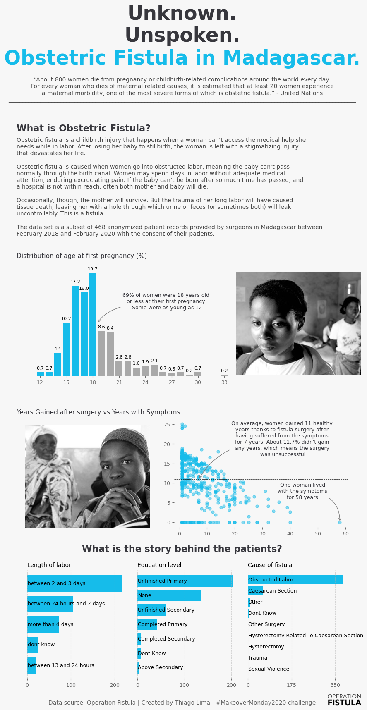
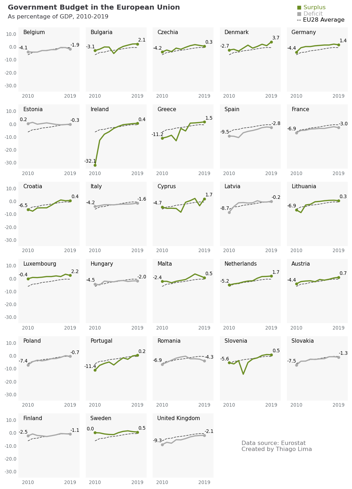
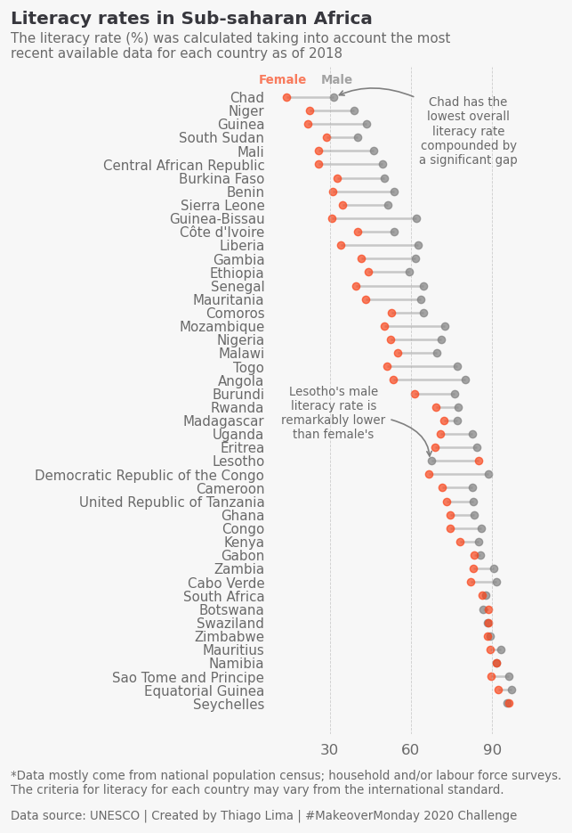
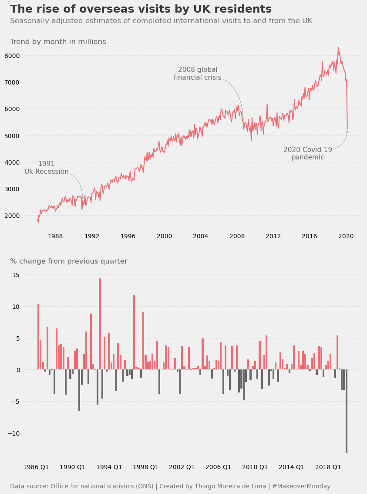

<h1 style="font-weight:normal" align="center">
  &nbsp;Data Visualization Portfolio&nbsp;
</h1>

:link: [LinkedIn][LinkedIn]&nbsp;&nbsp;&nbsp;|&nbsp;&nbsp;&nbsp;:link: [Email][Email]&nbsp;&nbsp;&nbsp;|&nbsp;&nbsp;&nbsp;:link: [Tableau Public][tableau]

  
This is a collection of some of my data visualizations about a variety of topics such as economics and social issues. Each folder contains the final plot as well as the Python script and data used to create it without any post-processing. Use the links below to navigate directly to the associated directory.

[LinkedIn]:https://www.linkedin.com/in/thiagomoreiradelima/
[Email]:mailto:thiago.moreira.lima@outlook.com
[tableau]:https://public.tableau.com/profile/thiago.moreira#!/

#
### [Cost of Mobile Data](https://https://github.com/thiago-mlima/Data-Visualization-Portfolio/tree/master/cost-of-mobile-data)

#
### [Obstetric Fistula in Magadascar](https://github.com/thiago-mlima/Data-Visualization-Portfolio/tree/master/obstetric-fistula-in-madagascar)

#
### [Government budget in the EU](https://github.com/thiago-mlima/Data-Visualization-Portfolio/tree/master/government-budget-in-the-eu)

#
### [Literacy rates in sub-saharan Africa](https://github.com/thiago-mlima/Data-Visualization-Portfolio/tree/master/literacy-rates-in-sub-saharan-africa) 

#
### [UK visits abroad](https://github.com/thiago-mlima/Data-Visualization-Portfolio/tree/master/uk-visits-abroad)

