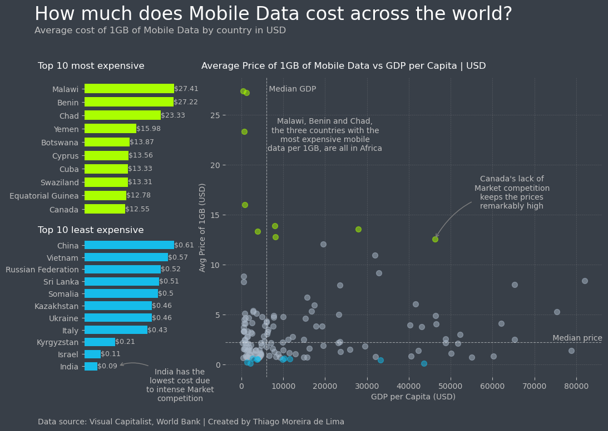

<h1 style="font-weight:normal" align="center">
  &nbsp;Data Visualization Portfolio&nbsp;
</h1>

:link: [LinkedIn][LinkedIn]&nbsp;&nbsp;&nbsp;|&nbsp;&nbsp;&nbsp;:link: [Tableau Public][tableau]

  
This is a collection of miscellaneous data visualizations created to illustrate my approach to data storytelling, and as a personal exercise to design compelling plots using only Python and Matplotlib, without any post-processing.

Each folder contains the final plot along with the Python-based Jupyter Notebook and dataset used to generate it. Use the links below to navigate directly to each example.

Feel free to reach out if you have any feedback, questions, or just want to exchange knowledge on data visualization and storytelling.

[LinkedIn]:https://www.linkedin.com/in/mlima-thiago/
[tableau]:https://public.tableau.com/app/profile/mlima.thiago/vizzes

#
### [Cost of Mobile Data](https://github.com/thiago-mlima/Data-Visualization-Portfolio/tree/master/cost-of-mobile-data)

#
### [Obstetric Fistula in Magadascar](https://github.com/thiago-mlima/Data-Visualization-Portfolio/tree/master/obstetric-fistula-in-madagascar)

#
### [Government budget in the EU](https://github.com/thiago-mlima/Data-Visualization-Portfolio/tree/master/government-budget-in-the-eu)

#
### [Literacy rates in sub-saharan Africa](https://github.com/thiago-mlima/Data-Visualization-Portfolio/tree/master/literacy-rates-in-sub-saharan-africa) 

#
### [UK visits abroad](https://github.com/thiago-mlima/Data-Visualization-Portfolio/tree/master/uk-visits-abroad)

